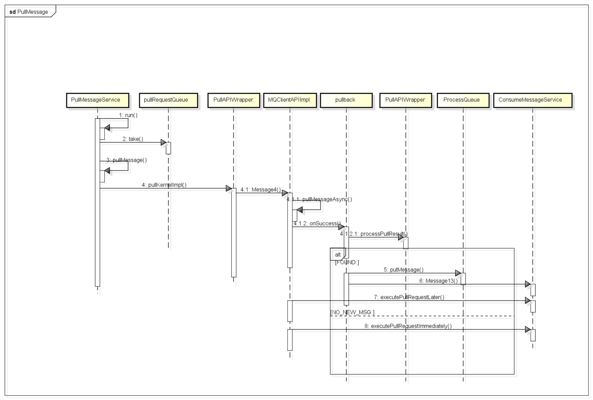
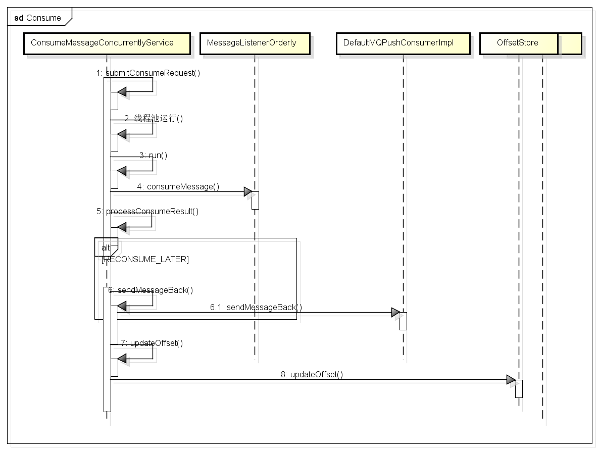

# RocketMQ源码分析之Consumer端(下）

consumer端是通过PullMessageService线程不断拉取消息


首当其冲的是run方法


```
@Override
    public void run() {
        log.info(this.getServiceName() + " service started");

        while (!this.isStopped()) {
            try {
                PullRequest pullRequest = this.pullRequestQueue.take();
                this.pullMessage(pullRequest);
            } catch (InterruptedException ignored) {
            } catch (Exception e) {
                log.error("Pull Message Service Run Method exception", e);
            }
        }

        log.info(this.getServiceName() + " service end");
    }
```


```
public void pullMessage(final PullRequest pullRequest) {
        final ProcessQueue processQueue = pullRequest.getProcessQueue();
        ///..

        final long beginTimestamp = System.currentTimeMillis();
        设置callback
       PullCallback pullCallback = new PullCallback() {
            @Override
            public void onSuccess(PullResult pullResult) {
                if (pullResult != null) {
                    pullResult = DefaultMQPushConsumerImpl.this.pullAPIWrapper.processPullResult(pullRequest.getMessageQueue(), pullResult,
                        subscriptionData);
                    switch (pullResult.getPullStatus()) {
                        //// 设置下次拉取消息队列位置
                        case FOUND:
                            long prevRequestOffset = pullRequest.getNextOffset();
                            pullRequest.setNextOffset(pullResult.getNextBeginOffset());
                            long pullRT = System.currentTimeMillis() - beginTimestamp;
                            DefaultMQPushConsumerImpl.this.getConsumerStatsManager().incPullRT(pullRequest.getConsumerGroup(),
                                pullRequest.getMessageQueue().getTopic(), pullRT);

                            long firstMsgOffset = Long.MAX_VALUE;
                            if (pullResult.getMsgFoundList() == null || pullResult.getMsgFoundList().isEmpty()) {
                                DefaultMQPushConsumerImpl.this.executePullRequestImmediately(pullRequest);
                            } else {
                                firstMsgOffset = pullResult.getMsgFoundList().get(0).getQueueOffset();

                                DefaultMQPushConsumerImpl.this.getConsumerStatsManager().incPullTPS(pullRequest.getConsumerGroup(),
                                    pullRequest.getMessageQueue().getTopic(), pullResult.getMsgFoundList().size());
                                // 提交拉取到的消息到消息处理队列
                                boolean dispatchToConsume = processQueue.putMessage(pullResult.getMsgFoundList());
                                //提交消费请求
                                DefaultMQPushConsumerImpl.this.consumeMessageService.submitConsumeRequest(
                                    pullResult.getMsgFoundList(),
                                    processQueue,
                                    pullRequest.getMessageQueue(),
                                    dispatchToConsume);

                                if (DefaultMQPushConsumerImpl.this.defaultMQPushConsumer.getPullInterval() > 0) {
                                    DefaultMQPushConsumerImpl.this.executePullRequestLater(pullRequest,
                                        DefaultMQPushConsumerImpl.this.defaultMQPushConsumer.getPullInterval());
                                } else {
                                    DefaultMQPushConsumerImpl.this.executePullRequestImmediately(pullRequest);
                                }
                            }

                            if (pullResult.getNextBeginOffset() < prevRequestOffset
                                || firstMsgOffset < prevRequestOffset) {
                                log.warn(
                                    "[BUG] pull message result maybe data wrong, nextBeginOffset: {} firstMsgOffset: {} prevRequestOffset: {}",
                                    pullResult.getNextBeginOffset(),
                                    firstMsgOffset,
                                    prevRequestOffset);
                            }

                            break;
                        case NO_NEW_MSG:
                            // 设置下次拉取消息队列位置
                            pullRequest.setNextOffset(pullResult.getNextBeginOffset());
                            //持久化消费进度
                            DefaultMQPushConsumerImpl.this.correctTagsOffset(pullRequest);
                            //立即拉取
                            DefaultMQPushConsumerImpl.this.executePullRequestImmediately(pullRequest);
                            break;
                        case NO_MATCHED_MSG:
                            pullRequest.setNextOffset(pullResult.getNextBeginOffset());

                            DefaultMQPushConsumerImpl.this.correctTagsOffset(pullRequest);

                            DefaultMQPushConsumerImpl.this.executePullRequestImmediately(pullRequest);
                            break;
                        case OFFSET_ILLEGAL:
                            log.warn("the pull request offset illegal, {} {}",
                                pullRequest.toString(), pullResult.toString());
                            pullRequest.setNextOffset(pullResult.getNextBeginOffset());

                            pullRequest.getProcessQueue().setDropped(true);
                            DefaultMQPushConsumerImpl.this.executeTaskLater(new Runnable() {

                                @Override
                                public void run() {
                                    try {
                                        DefaultMQPushConsumerImpl.this.offsetStore.updateOffset(pullRequest.getMessageQueue(),
                                            pullRequest.getNextOffset(), false);

                                        DefaultMQPushConsumerImpl.this.offsetStore.persist(pullRequest.getMessageQueue());

                                        DefaultMQPushConsumerImpl.this.rebalanceImpl.removeProcessQueue(pullRequest.getMessageQueue());

                                        log.warn("fix the pull request offset, {}", pullRequest);
                                    } catch (Throwable e) {
                                        log.error("executeTaskLater Exception", e);
                                    }
                                }
                            }, 10000);
                            break;
                        default:
                            break;
                    }
                }
            }

            @Override
            public void onException(Throwable e) {
                if (!pullRequest.getMessageQueue().getTopic().startsWith(MixAll.RETRY_GROUP_TOPIC_PREFIX)) {
                    log.warn("execute the pull request exception", e);
                }

                DefaultMQPushConsumerImpl.this.executePullRequestLater(pullRequest, pullTimeDelayMillsWhenException);
            }
        };

        boolean commitOffsetEnable = false;
        long commitOffsetValue = 0L;
        if (MessageModel.CLUSTERING == this.defaultMQPushConsumer.getMessageModel()) {
            commitOffsetValue = this.offsetStore.readOffset(pullRequest.getMessageQueue(), ReadOffsetType.READ_FROM_MEMORY);
            if (commitOffsetValue > 0) {
                commitOffsetEnable = true;
            }
        }

        String subExpression = null;
        boolean classFilter = false;
        SubscriptionData sd = this.rebalanceImpl.getSubscriptionInner().get(pullRequest.getMessageQueue().getTopic());
        if (sd != null) {
            if (this.defaultMQPushConsumer.isPostSubscriptionWhenPull() && !sd.isClassFilterMode()) {
                subExpression = sd.getSubString();
            }
            classFilter = sd.isClassFilterMode();
        }

        int sysFlag = PullSysFlag.buildSysFlag(
            commitOffsetEnable, // commitOffset
            true, // suspend
            subExpression != null, // subscription
            classFilter // class filter
        );
        // 执行拉取.如果拉取请求发生异常时，提交延迟拉取消息请求。
        try {
            this.pullAPIWrapper.pullKernelImpl(
                pullRequest.getMessageQueue(),
                subExpression,
                subscriptionData.getExpressionType(),
                subscriptionData.getSubVersion(),
                pullRequest.getNextOffset(),
                this.defaultMQPushConsumer.getPullBatchSize(),
                sysFlag,
                commitOffsetValue,
                BROKER_SUSPEND_MAX_TIME_MILLIS,
                CONSUMER_TIMEOUT_MILLIS_WHEN_SUSPEND,
                CommunicationMode.ASYNC,
                pullCallback
            );
        } catch (Exception e) {
            log.error("pullKernelImpl exception", e);
            this.executePullRequestLater(pullRequest, pullTimeDelayMillsWhenException);
        }
    }
```


核心代码

org.apache.rocketmq.client.impl.consumer.PullAPIWrapper#pullKernelImpl

```
public PullResult pullKernelImpl(
        final MessageQueue mq,
        final String subExpression,
        final String expressionType,
        final long subVersion,
        final long offset,
        final int maxNums,
        final int sysFlag,
        final long commitOffset,
        final long brokerSuspendMaxTimeMillis,
        final long timeoutMillis,
        final CommunicationMode communicationMode,
        final PullCallback pullCallback
    ) throws MQClientException, RemotingException, MQBrokerException, InterruptedException {
        //计算拉取的BrokerId
        FindBrokerResult findBrokerResult =
            this.mQClientFactory.findBrokerAddressInSubscribe(mq.getBrokerName(),
                this.recalculatePullFromWhichNode(mq), false);
        if (null == findBrokerResult) {
            this.mQClientFactory.updateTopicRouteInfoFromNameServer(mq.getTopic());
            findBrokerResult =
                this.mQClientFactory.findBrokerAddressInSubscribe(mq.getBrokerName(),
                    this.recalculatePullFromWhichNode(mq), false);
        }

        if (findBrokerResult != null) {
            {
                // check version
                if (!ExpressionType.isTagType(expressionType)
                    && findBrokerResult.getBrokerVersion() < MQVersion.Version.V4_1_0_SNAPSHOT.ordinal()) {
                    throw new MQClientException("The broker[" + mq.getBrokerName() + ", "
                        + findBrokerResult.getBrokerVersion() + "] does not upgrade to support for filter message by " + expressionType, null);
                }
            }
            int sysFlagInner = sysFlag;

            if (findBrokerResult.isSlave()) {
                sysFlagInner = PullSysFlag.clearCommitOffsetFlag(sysFlagInner);
            }

            PullMessageRequestHeader requestHeader = new PullMessageRequestHeader();
            requestHeader.setConsumerGroup(this.consumerGroup);
            requestHeader.setTopic(mq.getTopic());
            requestHeader.setQueueId(mq.getQueueId());
            requestHeader.setQueueOffset(offset);
            requestHeader.setMaxMsgNums(maxNums);
            requestHeader.setSysFlag(sysFlagInner);
            requestHeader.setCommitOffset(commitOffset);
            requestHeader.setSuspendTimeoutMillis(brokerSuspendMaxTimeMillis);
            requestHeader.setSubscription(subExpression);
            requestHeader.setSubVersion(subVersion);
            requestHeader.setExpressionType(expressionType);

            String brokerAddr = findBrokerResult.getBrokerAddr();
            if (PullSysFlag.hasClassFilterFlag(sysFlagInner)) {
                brokerAddr = computPullFromWhichFilterServer(mq.getTopic(), brokerAddr);
            }
            //拉取消息
            PullResult pullResult = this.mQClientFactory.getMQClientAPIImpl().pullMessage(
                brokerAddr,
                requestHeader,
                timeoutMillis,
                communicationMode,
                pullCallback);

            return pullResult;
        }

        throw new MQClientException("The broker[" + mq.getBrokerName() + "] not exist", null);
    }
```

异步发消息,通过callback来处理返回消息


org.apache.rocketmq.client.impl.MQClientAPIImpl#pullMessageAsync


```
 private void pullMessageAsync(
        final String addr,
        final RemotingCommand request,
        final long timeoutMillis,
        final PullCallback pullCallback
    ) throws RemotingException, InterruptedException {
        this.remotingClient.invokeAsync(addr, request, timeoutMillis, new InvokeCallback() {
            @Override
            public void operationComplete(ResponseFuture responseFuture) {
                RemotingCommand response = responseFuture.getResponseCommand();
                if (response != null) {
                    try {
                        PullResult pullResult = MQClientAPIImpl.this.processPullResponse(response);
                        assert pullResult != null;
                        
                        pullCallback.onSuccess(pullResult);
                    } catch (Exception e) {
                        pullCallback.onException(e);
                    }
                } else {
                    if (!responseFuture.isSendRequestOK()) {
                        pullCallback.onException(new MQClientException("send request failed to " + addr + ". Request: " + request, responseFuture.getCause()));
                    } else if (responseFuture.isTimeout()) {
                        pullCallback.onException(new MQClientException("wait response from " + addr + " timeout :" + responseFuture.getTimeoutMillis() + "ms" + ". Request: " + request,
                            responseFuture.getCause()));
                    } else {
                        pullCallback.onException(new MQClientException("unknown reason. addr: " + addr + ", timeoutMillis: " + timeoutMillis + ". Request: " + request, responseFuture.getCause()));
                    }
                }
            }
        });
    }
```


之后来到CallBack方法


首先进行result处理

org.apache.rocketmq.client.impl.consumer.PullAPIWrapper#processPullResult

```
 public PullResult processPullResult(final MessageQueue mq, final PullResult pullResult,
        final SubscriptionData subscriptionData) {
        PullResultExt pullResultExt = (PullResultExt) pullResult;

        this.updatePullFromWhichNode(mq, pullResultExt.getSuggestWhichBrokerId());
        if (PullStatus.FOUND == pullResult.getPullStatus()) {
            ByteBuffer byteBuffer = ByteBuffer.wrap(pullResultExt.getMessageBinary());
            List<MessageExt> msgList = MessageDecoder.decodes(byteBuffer);

            List<MessageExt> msgListFilterAgain = msgList;
            if (!subscriptionData.getTagsSet().isEmpty() && !subscriptionData.isClassFilterMode()) {
                msgListFilterAgain = new ArrayList<MessageExt>(msgList.size());
                for (MessageExt msg : msgList) {
                    if (msg.getTags() != null) {
                        if (subscriptionData.getTagsSet().contains(msg.getTags())) {
                            msgListFilterAgain.add(msg);
                        }
                    }
                }
            }

            if (this.hasHook()) {
                FilterMessageContext filterMessageContext = new FilterMessageContext();
                filterMessageContext.setUnitMode(unitMode);
                filterMessageContext.setMsgList(msgListFilterAgain);
                this.executeHook(filterMessageContext);
            }

            for (MessageExt msg : msgListFilterAgain) {
                String traFlag = msg.getProperty(MessageConst.PROPERTY_TRANSACTION_PREPARED);
                if (Boolean.parseBoolean(traFlag)) {
                    msg.setTransactionId(msg.getProperty(MessageConst.PROPERTY_UNIQ_CLIENT_MESSAGE_ID_KEYIDX));
                }
                MessageAccessor.putProperty(msg, MessageConst.PROPERTY_MIN_OFFSET,
                    Long.toString(pullResult.getMinOffset()));
                MessageAccessor.putProperty(msg, MessageConst.PROPERTY_MAX_OFFSET,
                    Long.toString(pullResult.getMaxOffset()));
                msg.setBrokerName(mq.getBrokerName());
            }

            pullResultExt.setMsgFoundList(msgListFilterAgain);
        }

        pullResultExt.setMessageBinary(null);

        return pullResult;
    }
```


org.apache.rocketmq.client.impl.consumer.ProcessQueue#putMessage

```
public boolean putMessage(final List<MessageExt> msgs) {
        boolean dispatchToConsume = false;
        try {
            //加锁
            this.lockTreeMap.writeLock().lockInterruptibly();
            try {
                int validMsgCnt = 0;
                for (MessageExt msg : msgs) {
                    MessageExt old = msgTreeMap.put(msg.getQueueOffset(), msg);
                    if (null == old) {
                        validMsgCnt++;
                        this.queueOffsetMax = msg.getQueueOffset();
                        msgSize.addAndGet(msg.getBody().length);
                    }
                }
                msgCount.addAndGet(validMsgCnt);
            //将信息放入msgTreeMap中
                if (!msgTreeMap.isEmpty() && !this.consuming) {
                    dispatchToConsume = true;
                    this.consuming = true;
                }

                if (!msgs.isEmpty()) {
                    MessageExt messageExt = msgs.get(msgs.size() - 1);
                    String property = messageExt.getProperty(MessageConst.PROPERTY_MAX_OFFSET);
                    if (property != null) {
                        long accTotal = Long.parseLong(property) - messageExt.getQueueOffset();
                        if (accTotal > 0) {
                            this.msgAccCnt = accTotal;
                        }
                    }
                }
            } finally {
                this.lockTreeMap.writeLock().unlock();
            }
        } catch (InterruptedException e) {
            log.error("putMessage exception", e);
        }

        return dispatchToConsume;
    }
```

总结一哈





**ConsumeMessageConcurrentlyService**


这个Service是用来消费message的


首先会进入submitConsumeRequest方法

org.apache.rocketmq.client.impl.consumer.ConsumeMessageConcurrentlyService#submitConsumeRequest


```
 public void submitConsumeRequest(
        final List<MessageExt> msgs,
        final ProcessQueue processQueue,
        final MessageQueue messageQueue,
        final boolean dispatchToConsume) {
        final int consumeBatchSize = this.defaultMQPushConsumer.getConsumeMessageBatchMaxSize();
        if (msgs.size() <= consumeBatchSize) {
            //// 提交消息小于批量消息数，直接提交消费请求
            ConsumeRequest consumeRequest = new ConsumeRequest(msgs, processQueue, messageQueue);
            try {
                this.consumeExecutor.submit(consumeRequest);
                // 如果被拒绝，则将当前拆分消息+剩余消息提交延迟消费请求。
            } catch (RejectedExecutionException e) {
                this.submitConsumeRequestLater(consumeRequest);
            }
        } else {
            //提消息大于批量消息数，进行分拆成多个消费请求
            for (int total = 0; total < msgs.size(); ) {
                List<MessageExt> msgThis = new ArrayList<MessageExt>(consumeBatchSize);
                for (int i = 0; i < consumeBatchSize; i++, total++) {
                    if (total < msgs.size()) {
                        msgThis.add(msgs.get(total));
                    } else {
                        break;
                    }
                }
                // 提交拆分消费请求
                ConsumeRequest consumeRequest = new ConsumeRequest(msgThis, processQueue, messageQueue);
                try {
                    this.consumeExecutor.submit(consumeRequest);
                } catch (RejectedExecutionException e) {
                    for (; total < msgs.size(); total++) {
                        msgThis.add(msgs.get(total));
                    }

                    this.submitConsumeRequestLater(consumeRequest);
                }
            }
        }
    }
```

其中可以看到将ConsumeRequest放入线程池中等待运行


我们可以看到ConsumeRequest其实继承了Runnable


```
 public void run() {
            if (this.processQueue.isDropped()) {
                log.info("the message queue not be able to consume, because it's dropped. group={} {}", ConsumeMessageConcurrentlyService.this.consumerGroup, this.messageQueue);
                return;
            }

            MessageListenerConcurrently listener = ConsumeMessageConcurrentlyService.this.messageListener;
            ConsumeConcurrentlyContext context = new ConsumeConcurrentlyContext(messageQueue);
            ConsumeConcurrentlyStatus status = null;
            defaultMQPushConsumerImpl.resetRetryAndNamespace(msgs, defaultMQPushConsumer.getConsumerGroup());

            ConsumeMessageContext consumeMessageContext = null;
            if (ConsumeMessageConcurrentlyService.this.defaultMQPushConsumerImpl.hasHook()) {
                consumeMessageContext = new ConsumeMessageContext();
                consumeMessageContext.setNamespace(defaultMQPushConsumer.getNamespace());
                consumeMessageContext.setConsumerGroup(defaultMQPushConsumer.getConsumerGroup());
                consumeMessageContext.setProps(new HashMap<String, String>());
                consumeMessageContext.setMq(messageQueue);
                consumeMessageContext.setMsgList(msgs);
                consumeMessageContext.setSuccess(false);
                ConsumeMessageConcurrentlyService.this.defaultMQPushConsumerImpl.executeHookBefore(consumeMessageContext);
            }

            long beginTimestamp = System.currentTimeMillis();
            boolean hasException = false;
            // 消费返回结果类型
            ConsumeReturnType returnType = ConsumeReturnType.SUCCESS;
            try {
                if (msgs != null && !msgs.isEmpty()) {
                    for (MessageExt msg : msgs) {
                        MessageAccessor.setConsumeStartTimeStamp(msg, String.valueOf(System.currentTimeMillis()));
                    }
                }
                // 进行消费
                status = listener.consumeMessage(Collections.unmodifiableList(msgs), context);
            } catch (Throwable e) {
                log.warn("consumeMessage exception: {} Group: {} Msgs: {} MQ: {}",
                    RemotingHelper.exceptionSimpleDesc(e),
                    ConsumeMessageConcurrentlyService.this.consumerGroup,
                    msgs,
                    messageQueue);
                hasException = true;
            }
            long consumeRT = System.currentTimeMillis() - beginTimestamp;
            //解析消费类型
            if (null == status) {
                if (hasException) {
                    returnType = ConsumeReturnType.EXCEPTION;
                } else {
                    returnType = ConsumeReturnType.RETURNNULL;
                }
            } else if (consumeRT >= defaultMQPushConsumer.getConsumeTimeout() * 60 * 1000) {
                returnType = ConsumeReturnType.TIME_OUT;
            } else if (ConsumeConcurrentlyStatus.RECONSUME_LATER == status) {
                returnType = ConsumeReturnType.FAILED;
            } else if (ConsumeConcurrentlyStatus.CONSUME_SUCCESS == status) {
                returnType = ConsumeReturnType.SUCCESS;
            }

            if (ConsumeMessageConcurrentlyService.this.defaultMQPushConsumerImpl.hasHook()) {
                consumeMessageContext.getProps().put(MixAll.CONSUME_CONTEXT_TYPE, returnType.name());
            }

            if (null == status) {
                log.warn("consumeMessage return null, Group: {} Msgs: {} MQ: {}",
                    ConsumeMessageConcurrentlyService.this.consumerGroup,
                    msgs,
                    messageQueue);
                status = ConsumeConcurrentlyStatus.RECONSUME_LATER;
            }

            if (ConsumeMessageConcurrentlyService.this.defaultMQPushConsumerImpl.hasHook()) {
                consumeMessageContext.setStatus(status.toString());
                consumeMessageContext.setSuccess(ConsumeConcurrentlyStatus.CONSUME_SUCCESS == status);
                ConsumeMessageConcurrentlyService.this.defaultMQPushConsumerImpl.executeHookAfter(consumeMessageContext);
            }

            ConsumeMessageConcurrentlyService.this.getConsumerStatsManager()
                .incConsumeRT(ConsumeMessageConcurrentlyService.this.consumerGroup, messageQueue.getTopic(), consumeRT);
            // 处理消费结果
            if (!processQueue.isDropped()) {
                ConsumeMessageConcurrentlyService.this.processConsumeResult(status, context, this);
            } else {
                log.warn("processQueue is dropped without process consume result. messageQueue={}, msgs={}", messageQueue, msgs);
            }
        }
```


org.apache.rocketmq.client.impl.consumer.ConsumeMessageConcurrentlyService#processConsumeResult


```
 public void processConsumeResult(
        final ConsumeConcurrentlyStatus status,
        final ConsumeConcurrentlyContext context,
        final ConsumeRequest consumeRequest
    ) {
        int ackIndex = context.getAckIndex();

        if (consumeRequest.getMsgs().isEmpty())
            return;
         // 计算从consumeRequest.msgs[0]到consumeRequest.msgs[ackIndex]的消息消费成功
        switch (status) {
            case CONSUME_SUCCESS:
                if (ackIndex >= consumeRequest.getMsgs().size()) {
                    ackIndex = consumeRequest.getMsgs().size() - 1;
                }
                int ok = ackIndex + 1;
                int failed = consumeRequest.getMsgs().size() - ok;
                this.getConsumerStatsManager().incConsumeOKTPS(consumerGroup, consumeRequest.getMessageQueue().getTopic(), ok);
                this.getConsumerStatsManager().incConsumeFailedTPS(consumerGroup, consumeRequest.getMessageQueue().getTopic(), failed);
                break;
            case RECONSUME_LATER:
                ackIndex = -1;
                this.getConsumerStatsManager().incConsumeFailedTPS(consumerGroup, consumeRequest.getMessageQueue().getTopic(),
                    consumeRequest.getMsgs().size());
                break;
            default:
                break;
        }
        // 处理消费失败的消息
        switch (this.defaultMQPushConsumer.getMessageModel()) {
            case BROADCASTING:
                for (int i = ackIndex + 1; i < consumeRequest.getMsgs().size(); i++) {
                    MessageExt msg = consumeRequest.getMsgs().get(i);
                    log.warn("BROADCASTING, the message consume failed, drop it, {}", msg.toString());
                }
                break;
            case CLUSTERING:
                List<MessageExt> msgBackFailed = new ArrayList<MessageExt>(consumeRequest.getMsgs().size());
                for (int i = ackIndex + 1; i < consumeRequest.getMsgs().size(); i++) {
                    MessageExt msg = consumeRequest.getMsgs().get(i);
                    发送消息到Broker
                    boolean result = this.sendMessageBack(msg, context);
                    if (!result) {
                        msg.setReconsumeTimes(msg.getReconsumeTimes() + 1);
                        msgBackFailed.add(msg);
                    }
                }

                if (!msgBackFailed.isEmpty()) {
                    consumeRequest.getMsgs().removeAll(msgBackFailed);
                    呆会再消费
                    this.submitConsumeRequestLater(msgBackFailed, consumeRequest.getProcessQueue(), consumeRequest.getMessageQueue());
                }
                break;
            default:
                break;
        }
        //把消费好的东西上报个Broker
        long offset = consumeRequest.getProcessQueue().removeMessage(consumeRequest.getMsgs());
        if (offset >= 0 && !consumeRequest.getProcessQueue().isDropped()) {
            this.defaultMQPushConsumerImpl.getOffsetStore().updateOffset(consumeRequest.getMessageQueue(), offset, true);
        }
    }
```

总结一下




对于集群模式会定时将offset同步到Broker,广播模式会定时存储到本地