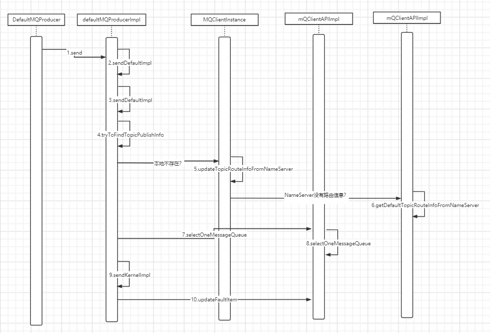

# RocketMQ源码分析之发送消息流程

这一章来学习Producer发送消息的流程,首先进入


```
   public class Producer {
public static void main(String[] args) throws MQClientException, InterruptedException {
    
        {
        //..
            SendResult sendResult = producer.send(msg); 
        //..    
        }
 }
 }
```


DEBUG进入send方法,可以发现其实内部是defaultMQProducerImpl在工作


```
 public SendResult send(Message msg) throws MQClientException, RemotingException, MQBrokerException, InterruptedException {
        Validators.checkMessage(msg, this);
        msg.setTopic(withNamespace(msg.getTopic()));
        return this.defaultMQProducerImpl.send(msg);
    }
```


再进入会进入核心流程


##### org.apache.rocketmq.client.impl.producer.DefaultMQProducerImpl#sendSelectImpl


```
private SendResult sendDefaultImpl(
    Message msg,
    final CommunicationMode communicationMode,
    final SendCallback sendCallback,
    final long timeout
) throws MQClientException, RemotingException, MQBrokerException, InterruptedException {
    //..
    
    //这里是会获取到topic的路由信息,总之就是发给哪个Broker
    TopicPublishInfo topicPublishInfo = this.tryToFindTopicPublishInfo(msg.getTopic());
    if (topicPublishInfo != null && topicPublishInfo.ok()) {
        boolean callTimeout = false;
        MessageQueue mq = null;
        Exception exception = null;
        SendResult sendResult = null;
        int timesTotal = communicationMode == CommunicationMode.SYNC ? 1 + this.defaultMQProducer.getRetryTimesWhenSendFailed() : 1;
     //..
     
     //循环发送消息保证成功
        for (; times < timesTotal; times++) {
            String lastBrokerName = null == mq ? null : mq.getBrokerName();
            //选择一个queue来发送
            MessageQueue mqSelected = this.selectOneMessageQueue(topicPublishInfo, lastBrokerName);
            if (mqSelected != null) {
                mq = mqSelected;
                brokersSent[times] = mq.getBrokerName();
                try {
                    //..
                        
                    //实际发送消息的地方
                    sendResult = this.sendKernelImpl(msg, mq, communicationMode, sendCallback, topicPublishInfo, timeout - costTime);
                    endTimestamp = System.currentTimeMillis();
                    
                    //发送完毕更新发送信息
                    this.updateFaultItem(mq.getBrokerName(), endTimestamp - beginTimestampPrev, false);
                    //..
                } catch (RemotingException e) {
                //..
                
                    }
}
```


#### 获得路由信息


先进入获取Topic路由信息的方法了解


##### org.apache.rocketmq.client.impl.producer.DefaultMQProducerImpl#tryToFindTopicPublishInfo


```
private TopicPublishInfo tryToFindTopicPublishInfo(final String topic) {
    //首先会从本地缓存获得路由信息
    TopicPublishInfo topicPublishInfo = this.topicPublishInfoTable.get(topic);
    if (null == topicPublishInfo || !topicPublishInfo.ok()) {
    //不存在则从NameServer获得信息
        this.topicPublishInfoTable.putIfAbsent(topic, new TopicPublishInfo());
        this.mQClientFactory.updateTopicRouteInfoFromNameServer(topic);
        topicPublishInfo = this.topicPublishInfoTable.get(topic);
    }
    
    if (topicPublishInfo.isHaveTopicRouterInfo() || topicPublishInfo.ok()) {
        return topicPublishInfo;
    } else {
   // 如果NameServer也不存在,则用系统默认的topic搜寻路由信息
        this.mQClientFactory.updateTopicRouteInfoFromNameServer(topic, true, this.defaultMQProducer);
        topicPublishInfo = this.topicPublishInfoTable.get(topic);
        return topicPublishInfo;
    }
}
```


**MQClientInstance#updateTopicRouteInfoFromNameServer(java.lang.String, boolean, org.apache.rocketmq.client.producer.DefaultMQProducer)**


这里核心可以看到通过defaultMQProducer.getCreateTopicKey()来获得信息,默认的topic是TBW102


```
public boolean updateTopicRouteInfoFromNameServer(final String topic, boolean isDefault,
    DefaultMQProducer defaultMQProducer) {
    try {
        if (this.lockNamesrv.tryLock(LOCK_TIMEOUT_MILLIS, TimeUnit.MILLISECONDS)) {
            try {
                TopicRouteData topicRouteData;
                if (isDefault && defaultMQProducer != null) {
                //通过默认topic查找信息
                    topicRouteData = this.mQClientAPIImpl.getDefaultTopicRouteInfoFromNameServer(defaultMQProducer.getCreateTopicKey(),
                        1000 * 3);
                    if (topicRouteData != null) {
                        for (QueueData data : topicRouteData.getQueueDatas()) {
                            int queueNums = Math.min(defaultMQProducer.getDefaultTopicQueueNums(), data.getReadQueueNums());
                            data.setReadQueueNums(queueNums);
                            data.setWriteQueueNums(queueNums);
                        }
                    }
                } else {
                    topicRouteData = this.mQClientAPIImpl.getTopicRouteInfoFromNameServer(topic, 1000 * 3);
                }
```


#### 选择发送的Queue


**org.apache.rocketmq.client.latency.MQFaultStrategy#selectOneMessageQueue**


```
public MessageQueue selectOneMessageQueue(final TopicPublishInfo tpInfo, final String lastBrokerName) {
    //查看是否开启发送延迟故障启用
    if (this.sendLatencyFaultEnable) {
        try {
            int index = tpInfo.getSendWhichQueue().getAndIncrement();
            for (int i = 0; i < tpInfo.getMessageQueueList().size(); i++) {
                int pos = Math.abs(index++) % tpInfo.getMessageQueueList().size();
                if (pos < 0)
                    pos = 0;
                MessageQueue mq = tpInfo.getMessageQueueList().get(pos);
                if (latencyFaultTolerance.isAvailable(mq.getBrokerName())) {
                    if (null == lastBrokerName || mq.getBrokerName().equals(lastBrokerName))
                        return mq;
                }
            }

            final String notBestBroker = latencyFaultTolerance.pickOneAtLeast();
            int writeQueueNums = tpInfo.getQueueIdByBroker(notBestBroker);
            if (writeQueueNums > 0) {
                final MessageQueue mq = tpInfo.selectOneMessageQueue();
                if (notBestBroker != null) {
                    mq.setBrokerName(notBestBroker);
                    mq.setQueueId(tpInfo.getSendWhichQueue().getAndIncrement() % writeQueueNums);
                }
                return mq;
            } else {
                latencyFaultTolerance.remove(notBestBroker);
            }
        } catch (Exception e) {
            log.error("Error occurred when selecting message queue", e);
        }

        return tpInfo.selectOneMessageQueue();
    }
    //不开启从这入口
    return tpInfo.selectOneMessageQueue(lastBrokerName);
}
```


这里通过为每个线程维护一个index,通过ThreadLocal的方法轮询实现负载均衡


```
public MessageQueue selectOneMessageQueue(final String lastBrokerName) {
    if (lastBrokerName == null) {
        return selectOneMessageQueue();
    } else {
        int index = this.sendWhichQueue.getAndIncrement();
        for (int i = 0; i < this.messageQueueList.size(); i++) {
            int pos = Math.abs(index++) % this.messageQueueList.size();
            if (pos < 0)
                pos = 0;
            MessageQueue mq = this.messageQueueList.get(pos);
            if (!mq.getBrokerName().equals(lastBrokerName)) {
                return mq;
            }
        }
        return selectOneMessageQueue();
    }
```


看到这里的sendWhichQueue是ThreadLocal的


#### 发送消息


**org.apache.rocketmq.client.impl.producer.DefaultMQProducerImpl#sendKernelImpl**


```
private SendResult sendKernelImpl(final Message msg,
    final MessageQueue mq,
    final CommunicationMode communicationMode,
    final SendCallback sendCallback,
    final TopicPublishInfo topicPublishInfo,
    final long timeout) throws MQClientException, RemotingException, MQBrokerException, InterruptedException {
    long beginStartTime = System.currentTimeMillis();
    String brokerAddr = this.mQClientFactory.findBrokerAddressInPublish(mq.getBrokerName());
    if (null == brokerAddr) {
        tryToFindTopicPublishInfo(mq.getTopic());
        brokerAddr = this.mQClientFactory.findBrokerAddressInPublish(mq.getBrokerName());
    }

    SendMessageContext context = null;
    if (brokerAddr != null) {
        //..
            SendResult sendResult = null;
            switch (communicationMode) {
                case ASYNC:
                    Message tmpMessage = msg;
                    boolean messageCloned = false;
                    if (msgBodyCompressed) {
                        //If msg body was compressed, msgbody should be reset using prevBody.
                        //Clone new message using commpressed message body and recover origin massage.
                        //Fix bug:https://github.com/apache/rocketmq-externals/issues/66
                        tmpMessage = MessageAccessor.cloneMessage(msg);
                        messageCloned = true;
                        msg.setBody(prevBody);
                    }

                //发送消息核心代码  
                    sendResult = this.mQClientFactory.getMQClientAPIImpl().sendMessage(
                        brokerAddr,
                        mq.getBrokerName(),
                        tmpMessage,
                        requestHeader,
                        timeout - costTimeAsync,
                        communicationMode,
                        sendCallback,
                        topicPublishInfo,
                        this.mQClientFactory,
                        this.defaultMQProducer.getRetryTimesWhenSendAsyncFailed(),
                        context,
                        this);
                    break;
                //..
    }
```


### 总结


用一张图总结下


